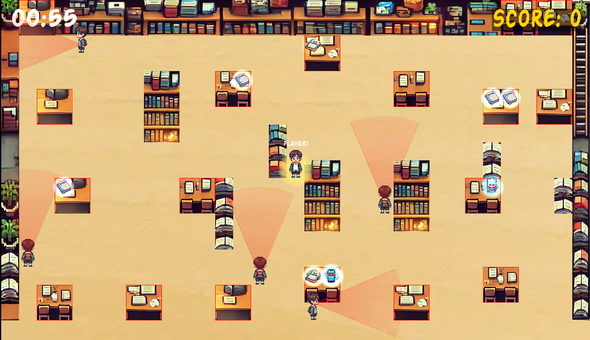

#  Study You To Death

A 2D stealth arcade game built from scratch using SDL2 in C++. Sneak through a haunted library, avoid patrolling students, collect notes, and escape before time runs out!


##  Screenshots

### Main Menu


### Gameplay


##  Features

- **Custom Game Engine** - Built from scratch with proper game loop architecture
- **Stealth Mechanics** - Avoid enemy field of view (cone detection system)
- **Multiple Game States** - Menu, Settings, and Gameplay screens with smooth transitions
- **Enemy AI** - Patrolling students with directional vision cones
- **Collision Detection** - Physics-based collision system for obstacles (tables, bookshelves)
- **Character Controller** - Smooth 2D character movement with sprite animations
- **Timer & Score System** - Race against the clock to maximize your score
- **Audio System** - Background music and sound effects using SDL2_mixer
- **UI System** - Custom rendered menus and HUD using SDL2_ttf

##  Tech Stack

| Technology | Purpose |
|------------|---------|
| C++17 | Core programming language |
| SDL2 | Window management & rendering |
| SDL2_image | Texture loading (PNG, JPG) |
| SDL2_ttf | Font rendering |
| SDL2_mixer | Audio playback |
| CMake | Cross-platform build system |

##  Project Structure

```
 main.cpp           # Entry point with game loop
 src/
    engine.cpp     # Core engine (init, update, render, cleanup)
    character.cpp  # Player controller and animations
    playground.cpp # Main gameplay logic
    menu.cpp       # Main menu implementation
    settings.cpp   # Settings page
    enemy.cpp      # Enemy AI with vision cone detection
    collectible.cpp# Collectible notes logic
    obstacle.cpp   # Tables & bookshelves collision
 include/           # Header files
 imgs/              # Game textures and sprites
 fonts/             # TTF font files
 SDL_lib/           # SDL2 library files
```

##  Building & Running

### Prerequisites
- CMake 3.10+
- SDL2, SDL2_image, SDL2_ttf, SDL2_mixer

### Build
```bash
mkdir build && cd build
cmake ..
make
./my_Final_project_game
```

##  Controls

| Key | Action |
|-----|--------|
| W/ | Move Up |
| S/ | Move Down |
| A/ | Move Left |
| D/ | Move Right |
| ESC | Pause/Menu |

##  Gameplay

- **Objective**: Collect all the notes scattered around the library
- **Avoid**: Patrolling students with flashlight vision cones
- **Timer**: Complete the level before time runs out
- **Score**: Collect notes to increase your score

##  Project Highlights

- **Game Engine Architecture** - Implemented a complete game loop with delta time for frame-rate independent movement
- **Stealth AI System** - Designed field of view (FOV) cone detection for realistic stealth mechanics
- **Modular OOP Design** - Structured codebase with separate classes for characters, enemies, obstacles, and collectibles
- **Resource Management** - Efficient texture loading, font rendering, and audio playback with proper cleanup
- **Cross-Platform Build** - CMake configuration supporting Windows, macOS, and Linux

##  License

MIT License - Feel free to use this code for learning purposes!
